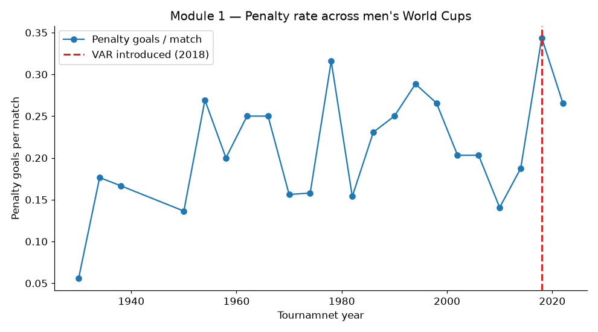
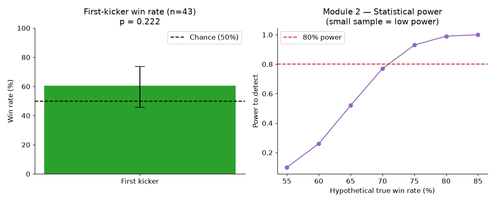
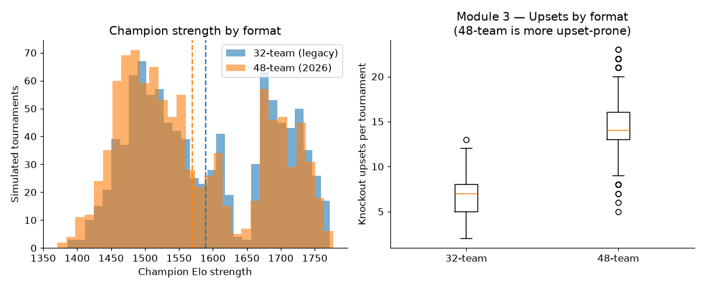

# FIFA World Cup — Experimentation & Causal Analytics

A three-module portfolio project demonstrating the **core experimentation
toolkit** an analytics role expects: a natural experiment, a quasi-randomised
natural experiment, and a fully designed A/B test. Each module is built on the
same open FIFA World Cup dataset, asks a real question, and reports results
honestly — including where the data is too thin to draw a conclusion.

> **Why this project exists.** Most analyst portfolios show predictive models
> on static data. They rarely show *experimentation* — hypothesis testing,
> causal inference, A/B test design, power analysis. This project closes that
> gap end to end.

---

## The three modules

| # | Question | Technique | Headline finding |
|---|----------|-----------|------------------|
| 1 | Did VAR (2018) change penalty rates? | Interrupted time-series + match-level Poisson GLM | Penalties **~2.16×** higher post-VAR at match level (p = 0.014); effect is real but invisible at tournament level — a power lesson |
| 2 | Does kicking first win shootouts? | Natural experiment (coin-toss randomisation) + binomial test | First kickers won **60.5%** (n = 43), but **not significant** (p = 0.22); power analysis shows the sample can only detect a >70% effect |
| 3 | 32-team vs 48-team format — more upsets? | Designed A/B test via Monte Carlo simulation | New 48-team format is **significantly more upset-prone**: 14.5 vs 6.6 knockout upsets per tournament |

---

## Module 1 — Did VAR change the game?

**Setup.** Video Assistant Referee debuted at the 2018 men's World Cup. The
penalty rate that year spiked to 0.34/match — but penalty rates are noisy, so
the question is whether 2018 was a genuine shift or just variance.

**Method.**
- *Primary:* match-level Poisson GLM over the modern era (552 matches), modelling
  penalty-goal counts with a year trend plus a post-VAR indicator. The
  exponentiated coefficient is an incidence-rate ratio.
- *Secondary:* tournament-level interrupted time-series (22 tournaments).
- *Robustness:* a placebo intervention at a fake year (2006).

**Result.** At the match level the effect is large and significant —
penalties **2.16× more likely** post-VAR (95% CI 1.17–3.98, p = 0.014).
At the tournament level the same effect is **not** significant (p = 0.21),
because 22 data points cannot resolve it. The contrast is the lesson:
*statistical power depends on your unit of analysis.*



---

## Module 2 — Does kicking first win the shootout?

**Why it's a natural experiment.** Shootout kick order is set by a coin toss —
random assignment we didn't have to engineer. That randomisation is what lets a
win-rate gap be read causally rather than as correlation.

**Method.** Reconstruct first-kicker and winner for all 43 World Cup shootouts;
binomial test against 50%; Wilson 95% CI; and a **power analysis** asking what
size of advantage this sample could even detect.

**Result.** First kickers won **60.5%** (95% CI 45.6%–73.6%) — directionally
consistent with published research, but **not statistically significant**
(p = 0.22). The power curve shows why: with 43 shootouts, only an advantage
above ~70% would be reliably detectable. *Reporting the null honestly, and
explaining it with power, is the point.*



---

## Module 3 — 32-team vs 48-team format: an A/B test

**Why it's an A/B test, not just a simulation.** Format is the treatment, with
two arms (legacy 32-team = control; 2026 48-team = treatment). Metrics are
**pre-registered**, both arms share a common random team-strength process, a
**power analysis** sets the sample size, and the comparison is a two-sample
hypothesis test with effect sizes. Monte Carlo simply supplies the randomised
"subjects" (tournaments) because real World Cups can't be randomised.

**Engine.** Team strengths are calibrated with an **Elo model** fit on every
historical men's World Cup match (the model correctly ranks Brazil, Germany,
France, Argentina near the top — a face-validity check). Each simulated
tournament runs a full group stage and single-elimination bracket under the
correct structure for its format.

**Pre-registered metrics.** champion Elo · top-4 seed won · knockout upsets ·
champion seed rank.

**Result (1,000 simulated tournaments per arm).**

| Metric | 32-team | 48-team | Significant? |
|--------|---------|---------|--------------|
| Champion Elo strength | 1589 | 1570 | Yes (weaker champions) |
| Top-4 seed wins title | 46% | 32% | Yes |
| Knockout upsets / tournament | 6.6 | 14.5 | Yes (d = 3.3) |

The 48-team format — by adding a Round of 32, an extra single-elimination
hurdle — is **measurably more favourable to underdogs**. Topical, since the
real tournament is using this exact format right now.



---

## Tech stack

Python · pandas · NumPy · SciPy · statsmodels · matplotlib

Techniques: interrupted time-series, Poisson GLM, binomial testing, Wilson
confidence intervals, statistical power analysis, Elo rating systems, Monte
Carlo simulation, two-sample hypothesis testing, effect sizes (Cohen's d),
pre-registration.

## Data

[jfjelstul/worldcup](https://github.com/jfjelstul/worldcup) — open World Cup
database (matches, goals, bookings, penalty shootouts, 1930–present). Downloaded
and cached automatically on first run.

## Run it

```bash
git clone https://github.com/adikumar1001/worldcup-experiments.git
cd worldcup-experiments
pip install -r requirements.txt

cd src
python data_loader.py        # download + cache + show the rate panel
python module1_var.py        # VAR interrupted time-series
python module2_shootout.py   # shootout natural experiment
python module3_format_ab.py  # 32 vs 48 team A/B test
python viz.py                # regenerate all figures

# or open the narrative walkthrough:
jupyter notebook notebooks/analysis.ipynb
```

## Project structure

```
worldcup-experiments/
├── README.md
├── requirements.txt
├── data/                    # cached CSVs (auto-downloaded)
├── figures/                 # exported plots
├── notebooks/
│   └── analysis.ipynb       # narrative walkthrough of all three modules
└── src/
    ├── data_loader.py       # download, cache, clean, rate panel
    ├── module1_var.py       # interrupted time-series + Poisson GLM
    ├── module2_shootout.py  # natural experiment + power analysis
    ├── elo.py               # Elo strength model
    ├── module3_format_ab.py # Monte Carlo A/B test
    └── viz.py               # figure generation
```

---

*Data source: jfjelstul open World Cup data. Built as an analytics portfolio project.*